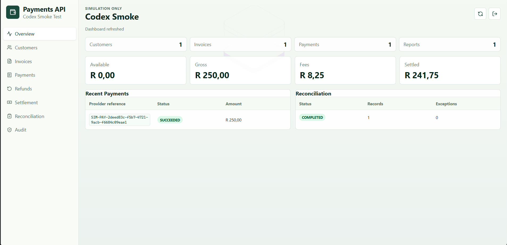
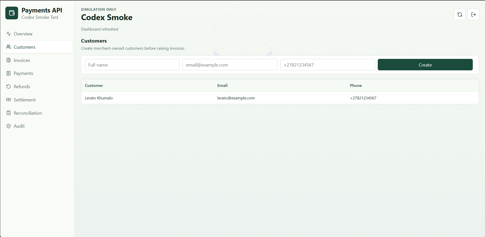
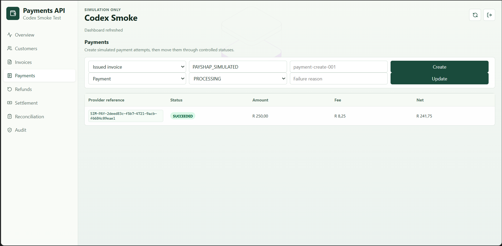
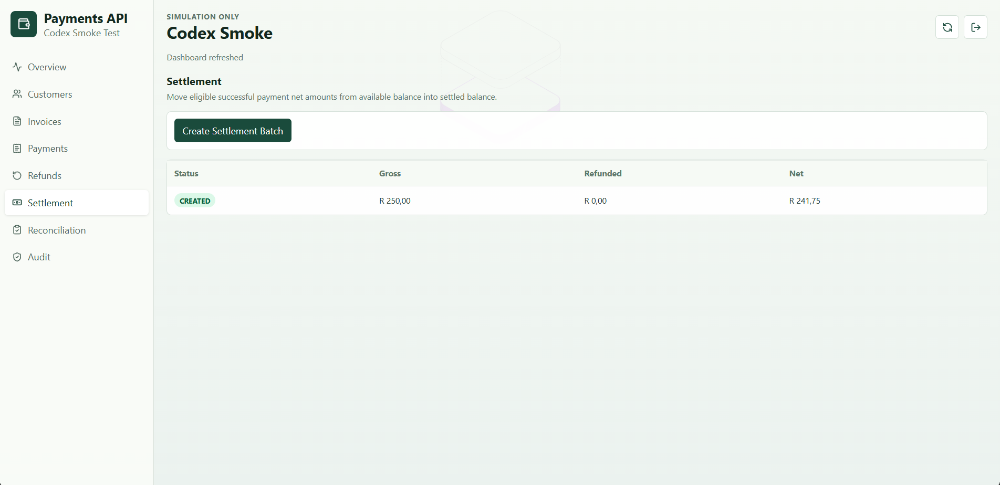
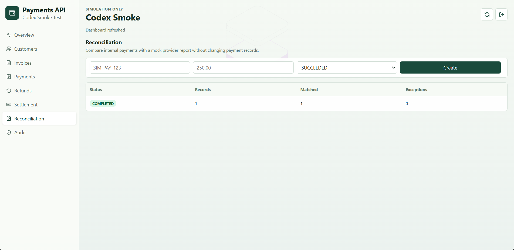
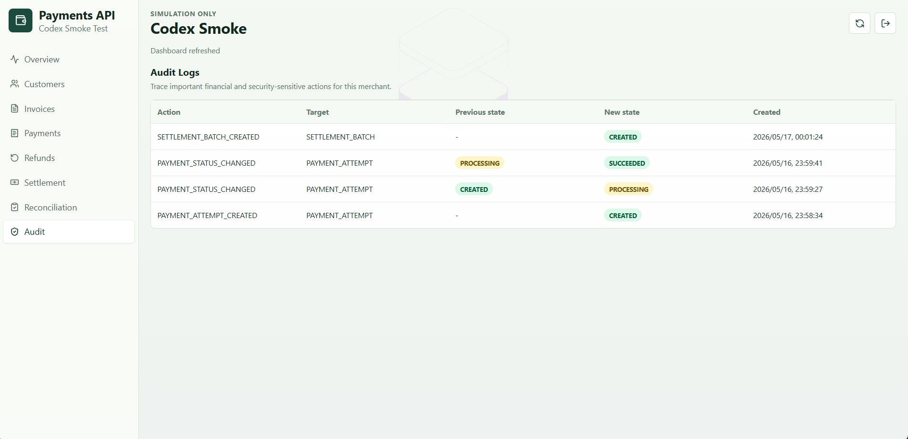
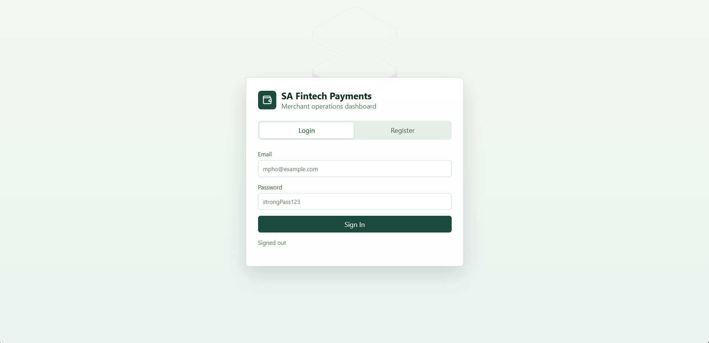

# sa-fintech-payments-api

`sa-fintech-payments-api` is a South African fintech backend learning lab. It simulates the merchant payment lifecycle from registration and invoicing through payment attempts, refunds, balances, settlement, reconciliation, and audit logs.

This is a safe portfolio simulation. It must never process real money or connect to real banks, card processors, PayShap services, debit order systems, or production payment providers.



## What This Project Shows

- Merchant onboarding with JWT authentication and merchant-scoped access.
- Customer and invoice management for ZAR invoices.
- Simulated payment attempts with controlled status transitions.
- Idempotent payment creation using merchant-scoped idempotency keys.
- Webhook event storage, duplicate detection, and out-of-order event handling.
- Refunds with over-refund protection and invoice/payment refund states.
- Fee calculation, merchant balance summaries, and manual settlement batches.
- Reconciliation against mock provider reports without mutating financial records.
- Merchant-scoped audit logs for important financial events.
- A React dashboard for running the demo without needing to hand-craft API calls.

## Product Walkthrough

Register or log in as a simulated merchant owner, create a customer, issue an invoice, create a simulated payment, move the payment to success, settle eligible funds, reconcile mock provider data, and inspect the audit trail.











## Fintech Concepts Modeled

**Successful payment is not settlement.** A payment can succeed and still not be paid out to the merchant until a settlement batch is created.

**Invoices and payment attempts are separate.** The invoice says what is owed. The payment attempt records the attempt to collect it, including provider reference, status, fees, and audit history.

**Retries need idempotency.** A repeated payment creation request with the same idempotency key returns the original result. Reusing the key with different request details is rejected.

**Webhooks are unreliable by design.** Simulated provider events can be duplicated or arrive out of order. The system stores events and makes explicit processing decisions.

**Reconciliation reports exceptions.** Mock provider records are compared against internal payments. Mismatches are reported and audited, but reconciliation does not silently rewrite payment state.

**Money needs deliberate rules.** Amounts use Java `BigDecimal`, PostgreSQL `NUMERIC(19,2)`, ZAR currency context, and deterministic fee rounding.

## Tech Stack

- Java 21
- Spring Boot 3.5.x
- Maven Wrapper
- PostgreSQL 16
- Flyway
- Spring Security
- JWT
- OpenAPI / Swagger UI
- React, TypeScript, and Vite
- JUnit 5
- Spring Boot Test
- Testcontainers
- Docker Compose

## Run The Full App

Start PostgreSQL:

```powershell
docker compose up -d postgres
```

Start the Spring Boot API:

```powershell
.\mvnw.cmd spring-boot:run
```

In a second terminal, start the dashboard:

```powershell
cd frontend
npm install
npm run dev
```

Open the dashboard:

```text
http://localhost:5173
```

The frontend calls `http://localhost:8080` by default. To use a different API URL, set `VITE_API_BASE_URL` before starting Vite.

## Demo Flow

1. Register a merchant owner from the dashboard.
2. Create a customer.
3. Create an invoice for that customer.
4. Create a simulated payment for the invoice.
5. Update the payment from `CREATED` to `PROCESSING` to `SUCCEEDED`.
6. Check the overview balance cards.
7. Create a settlement batch.
8. Submit a reconciliation record that matches or intentionally mismatches a payment.
9. Review audit logs to see the financial trail.

The login/register screen is intentionally simple because the project focuses on backend fintech behavior rather than marketing pages.



## Run Tests

Backend tests:

```powershell
.\mvnw.cmd test
```

Frontend checks:

```powershell
cd frontend
npm run lint
npm run build
```

The database integration tests use PostgreSQL through Testcontainers. Docker Desktop must be running for the full database-backed test coverage.

## API Documentation

With the backend running:

```text
http://localhost:8080/swagger-ui.html
http://localhost:8080/v3/api-docs
```

The docs endpoints and health check are public. Business routes require a JWT unless explicitly documented otherwise.

Health check:

```http
GET /api/v1/health
```

Register merchant owner:

```http
POST /api/v1/auth/register
Content-Type: application/json
```

```json
{
  "businessName": "Mpho Tutoring",
  "tradingName": "Mpho Maths",
  "merchantType": "TUTORING_BUSINESS",
  "ownerFullName": "Mpho Dlamini",
  "ownerEmail": "mpho@example.com",
  "password": "strongPass123"
}
```

Login:

```http
POST /api/v1/auth/login
Content-Type: application/json
```

```json
{
  "email": "mpho@example.com",
  "password": "strongPass123"
}
```

Create a simulated payment attempt:

```http
POST /api/v1/payments
Authorization: Bearer <access-token>
Idempotency-Key: payment-create-001
Content-Type: application/json
```

```json
{
  "invoiceId": "<invoice-id>",
  "paymentMethod": "PAYSHAP_SIMULATED"
}
```

Create a reconciliation report from mock provider records:

```http
POST /api/v1/reconciliation-reports
Authorization: Bearer <access-token>
Content-Type: application/json
```

```json
{
  "records": [
    {
      "providerReference": "SIM-PAY-123",
      "amount": 250.00,
      "currency": "ZAR",
      "status": "SUCCEEDED"
    }
  ]
}
```

## Architecture

The backend is a modular layered monolith. It is intentionally not a microservice system, because the learning goal is realistic fintech domain design without unnecessary distributed-system complexity.

Main domains:

- `auth`
- `merchant`
- `customer`
- `invoice`
- `payment`
- `webhook`
- `refund`
- `balance`
- `settlement`
- `reconciliation`
- `audit`
- `common`

The database schema is managed with Flyway migrations and includes merchant ownership paths for financial records. Important duplicate-prevention and isolation rules are backed by database constraints where practical.

## Database Tables

- `merchants`
- `merchant_users`
- `customers`
- `invoices`
- `payment_attempts`
- `idempotency_records`
- `webhook_events`
- `refunds`
- `merchant_balances`
- `settlement_batches`
- `settlement_batch_items`
- `reconciliation_reports`
- `reconciliation_report_items`
- `audit_logs`

## Local Profiles

The normal app run expects PostgreSQL:

```powershell
.\mvnw.cmd spring-boot:run
```

There is also a limited health-only local profile:

```powershell
.\mvnw.cmd spring-boot:run "-Dspring-boot.run.profiles=local"
```

The `local` profile disables database-backed merchant/auth endpoints and exists only as a lightweight fallback for checking the foundation app.

## Safety Boundaries

- No real money movement.
- No real provider integrations.
- No real bank account processing.
- No production payment credentials.
- No sensitive tokens or passwords in audit logs.
- Simulated provider references, webhooks, reconciliation records, and settlement batches only.

## Interview Story

This project is built milestone by milestone to show backend engineering judgment in a fintech domain. The important story is not just "CRUD for payments"; it is how the system protects financial state through merchant isolation, deterministic money handling, controlled transitions, idempotency, webhook safety, reconciliation visibility, settlement separation, and auditability.

Useful talking points:

- Why `BigDecimal` and `NUMERIC(19,2)` are used for money.
- Why payment attempts are separate from invoices.
- Why payment success does not mean settlement.
- Why reconciliation reports mismatches instead of mutating records.
- Why database constraints matter for financial safety.
- How the system could evolve toward a ledger, role-based access, pagination, and production-grade webhook signatures.
